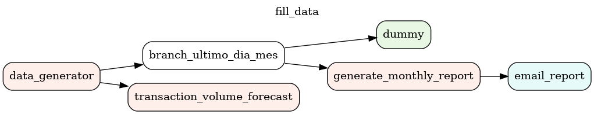
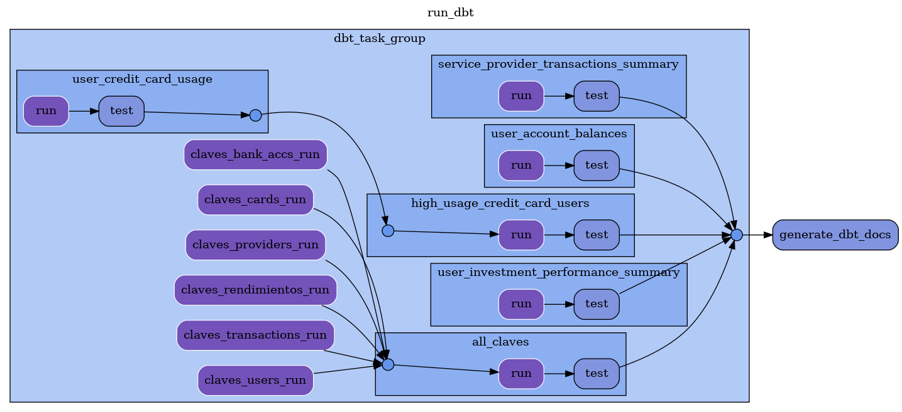

# Arquitectura y flujos de datos para MercadoPago

## Introducción

En este informe se presenta la arquitectura, los flujos de datos y los procesos de gobernanza para el modelo de datos de la plataforma MercadoPago.

<!-- @import "[TOC]" {cmd="toc" depthFrom=1 depthTo=6 orderedList=false} -->

<!-- code_chunk_output -->

- [Arquitectura y flujos de datos para MercadoPago](#arquitectura-y-flujos-de-datos-para-mercadopago)
  - [Introducción](#introducción)
  - [1. Arquitectura](#1-arquitectura)
    - [Origen de los datos](#origen-de-los-datos)
    - [Modelado de Datos - Trabajo Práctico 1 + Correcciones](#modelado-de-datos---trabajo-práctico-1--correcciones)
      - [Claves](#claves)
      - [Usuarios](#usuarios)
      - [Transacciones entre Usuarios](#transacciones-entre-usuarios)
      - [Transacciones a/desde Cuentas Bancarias Externas](#transacciones-adesde-cuentas-bancarias-externas)
      - [Pago de Servicios](#pago-de-servicios)
      - [Inversiones y rendimientos](#inversiones-y-rendimientos)
    - [Linaje de los datos](#linaje-de-los-datos)
    - [Usos de los datos en las distintas etapas](#usos-de-los-datos-en-las-distintas-etapas)
    - [Gobernanza del dato](#gobernanza-del-dato)
  - [2. Flujo de datos](#2-flujo-de-datos)
    - [Implementación del pipeline de carga](#implementación-del-pipeline-de-carga)
    - [Generación de datos](#generación-de-datos)
    - [Predicción de volumen de transacciones](#predicción-de-volumen-de-transacciones)
    - [Branch si es el último día del mes](#branch-si-es-el-último-día-del-mes)
    - [Reporte de fin de mes](#reporte-de-fin-de-mes)
    - [Email del reporte mensual](#email-del-reporte-mensual)
  - [3. Enriquecimiento de Datos con DBT](#3-enriquecimiento-de-datos-con-dbt)
    - [Uso de tarjetas de crédito por usuario: user_credit_card_usage](#uso-de-tarjetas-de-crédito-por-usuario-user_credit_card_usage)
    - [Usuarios con alto uso de tarjetas de crédito: high_usage_credit_card_users](#usuarios-con-alto-uso-de-tarjetas-de-crédito-high_usage_credit_card_users)
    - [Balances de cuentas de usuario: user_account_balances](#balances-de-cuentas-de-usuario-user_account_balances)
    - [Performance de inversiones por usuario: user_investment_performance_summary](#performance-de-inversiones-por-usuario-user_investment_performance_summary)
    - [Resumen de transacciones a proveedores de servicios: service_provider_transactions_summary](#resumen-de-transacciones-a-proveedores-de-servicios-service_provider_transactions_summary)
    - [Claves Uniformes (CBUs y CVUs)](#claves-uniformes-cbus-y-cvus)

<!-- /code_chunk_output -->

\newpage

## 1. Arquitectura

### Origen de los datos

_¿Cuál es el origen de los datos? ¿Qué cadencia tienen, con qué formato arriban, qué volumen se espera?_

Los datos provienen principalmente de las acciones generadas por los usuarios. Dentro de las acciones consideramos abrir cuentas, realizar transacciones y depositar dinero a rendir. En nuestro caso no consideramos fuentes externas de datos dada la simplificación del modelo.

En el trabajo utilizamos la librería _Faker_ para simular las acciones de los usuarios.

La generación de datos es la siguiente:

Primero, se crean una cantidad específica de usuarios, cuentas bancarias y proveedores de servicios.
Luego, se simula el paso del tiempo durante un período determinado.

La simulación depende de los siguientes parámetros:

```{r, setup, include=FALSE}
library(reticulate)
```

```{python, eval = FALSE}
num_users # (int): Número de usuarios
num_cuentas_bancarias # (int): Número de cuentas bancarias
num_servicios # (int): Número de servicios
num_transacciones_sin_saldo # (int): Número de transacciones a realizar en cuentas sin saldo
timespan # (int): Duración de la simulación en días
```

Para cada día simulado:

- Se actualiza la fecha simulada al día correspondiente.
- Algunos usuarios comienzan inversiones en la fecha simulada.
- Algunos usuarios pagan por servicios utilizando las cuentas de los proveedores de servicios creados.
- Se pagan los rendimientos de las inversiones activas a los usuarios.
- Cada usuario recibe depósitos aleatorios en sus cuentas.
- Se realizan transacciones entre usuarios seleccionados al azar, manejando posibles errores como la falta de saldo. La cantidad de transacciones por día es aleatoria.
- Si han pasado más de 30 días, se realiza una predicción del volumen de transacciones y se actualizan las tasas de interés anuales. Esto luego se correría de forma diaria como parte del DAG de Airflow asi que tambien lo simulamos de forma diaria.

Todos los datos tienen una cadencia diaria _(no estoy seguro de esto)_, aunque las transacciones y rendimientos se generan a una tasa mucho mas alta. Los datos llegan en formato JSON a través de una API. Se espera un volumen elevado de datos, en particular de transacciones, cercano a 300 transacciones por segundo.

### Modelado de Datos - Trabajo Práctico 1 + Correcciones

#### Claves

Todas las claves utilizadas en la plataforma siguen el formato de Clave Uniforme, tanto Bancaria (CBU) como Virtual (CVU). Estas claves son utilizadas para identificar a los usuarios, cuentas bancarias, y proveedores de servicios.

#### Usuarios

- La base de datos debe permitir el registro y almacenamiento de usuarios de la aplicación de Mercado Pago.
- Se requiere almacenar información personal de los usuarios, como nombre, dirección, correo electrónico, número de teléfono y CUIT.

#### Transacciones entre Usuarios

- Los usuarios deben poder realizar transacciones entre ellos dentro de la aplicación.
- Cada transacción debe registrar el monto, la fecha, la descripción y su estado (pendiente, fallida, completada).
- Las transacciones pueden ser realizadas con saldo en cuenta o con tarjetas de crédito. En caso de que se realice con tarjeta de crédito, la transacción tiene un costo extra de interés.

#### Transacciones a/desde Cuentas Bancarias Externas

- Los usuarios deben poder realizar transacciones de dinero desde sus cuentas de Mercado Pago a Cuentas Bancarias Externas. Estas transacciones pueden ser realizadas con saldo en cuenta o con tarjetas de crédito/débito.
- Los usuarios deben poder recibir transferencias desde Cuentas Bancarias Externas a sus cuentas de Mercado Pago.
- Cada transacción debe registrar el monto, la fecha, la cuenta bancaria de destino/origen y su estado.

#### Pago de Servicios

- Los usuarios deben poder utilizar la aplicación para pagar servicios, como facturas de servicios públicos, recargas de celular, etc. Son consideradas transacciones tambien.
- Las empresas que deseen cobrar sus servicios por Mercado Pago deben registrarse dentro de la aplicación como proveedor de servicio. Por simplificación, asumimos que las empresas cuentan con y brindan una Cuenta Bancaria Externa para realizar los cobros.
- Se necesita almacenar información sobre los servicios pagados, como el proveedor de servicio, el monto, la fecha y el destinatario del pago.

#### Inversiones y rendimientos

- Los usuarios deben poder invertir dinero y obtener rendimientos diarios a través de la aplicación.
- Se necesita almacenar información sobre las inversiones, como el monto invertido, la tasa de interés, la fecha de inicio y vencimiento, etc.
- Un usuario debe poder comenzar una inversión con saldo en cuenta. Si en algún momento, antes de que se pague el rendimiento, el saldo de la cuenta varía, se interrumpe la inversión a la fecha, y se crea una nueva inversión con el saldo actual. Eventualmente se pagaran por la duración de las inversión, tanto el rendimiento de la inversión original como el de la nueva inversión en curso hasta que termine.
- Los rendimientos se pagan a los usuarios como una transacción, originada por MercadoPago, en su propia cuenta de Mercado Pago. Esto lo corregimos respecto al trabajo anterior.

### Linaje de los datos

_¿Cómo es el linaje de los datos desde su origen hasta que las distintas aplicaciones los consumen? ¿Cómo son los procesos intermedios y qué patrones siguen?_

1. Generación de datos: los datos se generan a partir de tres sistemas: procesamiento de pagos, usuarios y rendimientos. Estos sistemas son los que se comunican con el usuario final y procesan las acciones que éstos realizan.
2. Carga de Datos en Postgres: Los datos generados se cargan en una base de datos Postgres.
3. DAG de Airflow: Se ejecuta un DAG de Airflow que procesa los datos generados y los transforma para generar métricas, predicciones y reportes.
4. Transformaciones con DBT: Los datos cargados se transforman para obtener información útil y generar reportes.
5. Consumo por aplicación: Los datos transformados son consumidos por aplicaciones de análisis y reportes al igual que por la aplicación de los usuarios.

### Usos de los datos en las distintas etapas

_¿Cuáles son los usos que tienen los datos en las distintas etapas de procesamiento?_

### Gobernanza del dato

_¿Cómo es la gobernanza del dato? ¿Cuáles son los roles y qué tipos de permisos tienen sobre los datos?_

- Roles y permisos: Administrador de Datos: Acceso completo para gestión y mantenimiento de la base de datos.
- Analista de Datos: Acceso a datos transformados y reportes, capacidad para ejecutar queries.
- Usuario Final: Acceso a reportes y dashboards, con permisos de solo lectura.

\newpage

## 2. Flujo de datos

### Implementación del pipeline de carga

El pipeline de carga de datos está implementado en Airflow con el siguiente DAG:




A continuación se detalla la función de cada nodo:

### Generación de datos
<br>

Simula una "ingesta" de datos en tiempo real, generando datos de usuarios, transacciones y rendimientos a partir de la librería Faker en un plazo de $n$ días (configurable en el operador). Estos datos se guardan en una base de datos Postgres modelada en el Trabajo Práctico 1.

### Predicción de volumen de transacciones
<br>

A partir de los datos ingestados, se computa el valor neto de dinero en la plataforma por día a partir de las transacciones que ingresaron dinero y las que lo retiraron. A partir de estos registros diarios, se fitea un modelo de _forecast_ (con `Prophet`) para las predicciones de transacción en los próximos 7 días. Luego, se calcula la variación porcentual de la predicción respecto al valor real de los últimos 7 días en promedio. Si la variación es mayor a un umbral, se actualiza la TNA de los rendimientos en la base de datos en función de la variación.

### Branch si es el último día del mes
<br>

Un BranchDateTimeOperator determina si es el último día del mes utilizando `pendulum`. En caso de que sí, se ejecuta el operador _ultimo_dia_mes_, y en caso de que no, no se realiza nada.

### Reporte de fin de mes
<br>

El operador genera un reporte mensual con algunas métricas sobre la aplicación en el último mes. Este reporte es utilizado internamente. Las principales métricas incluidas en el reporte son:

**Volumen Total Transaccionado**

**Volumen Total**: Calcula el volumen total de transacciones realizadas en el mes.

**Cambio Porcentual**: Calcula el cambio porcentual del volumen total comparado con el mes anterior.


**Cantidad de Transacciones por Tipo**

**Total de Transacciones**: Cuenta el número total de transacciones desglosadas por tipo.

**Cambio Porcentual**: Calcula el cambio porcentual en la cantidad de transacciones por cada tipo comparado con el mes anterior.

**Cantidad de Cuentas Nuevas**

**Nuevas Cuentas**: Cuenta el número de nuevas cuentas creadas durante el mes.

**Cambio Porcentual**: Calcula el cambio porcentual en la cantidad de nuevas cuentas comparado con el mes anterior.


**Ingreso/Egreso Total**

**Balance Neto**: Calcula el balance neto de ingresos y egresos para el mes.

**Cambio Porcentual**: Calcula el cambio porcentual en el balance neto comparado con el mes anterior.


**Intereses Ganados por Tarjetas de Crédito**

**Total de Intereses**: Suma los intereses ganados a través de las tarjetas de crédito durante el mes.

**Cambio Porcentual**: Calcula el cambio porcentual en los intereses ganados comparado con el mes anterior.

### Email del reporte mensual
<br>

Una vez generado el reporte mensual, el mismo se envía por email a quien se haya configurado en el operador. El reporte se envía en formato PDF.

justificación de la cadencia?

\newpage

## 3. Enriquecimiento de Datos con DBT

Los siguientes modelos de DBT que desarrollamos se ejecutan cada hora para mantener actualizados los datos y garantizar la disponibilidad de información en tiempo real.

La orquestación de los modelos DBT se realiza a través de Airflow, que ejecuta los modelos en el orden correcto y gestiona las dependencias entre ellos. El siguiente DAG muestra el flujo de los modelos DBT:



### Uso de tarjetas de crédito por usuario: user_credit_card_usage

Este modelo analiza el uso de las tarjetas de crédito por parte de los usuarios. Incluye detalles sobre las transacciones realizadas con tarjetas de crédito, proporcionando una visión completa del comportamiento de uso de los usuarios.

### Usuarios con alto uso de tarjetas de crédito: high_usage_credit_card_users

Este modelo identifica a los usuarios que tienen un alto uso de sus tarjetas de crédito y crea una vista. Al analizar los patrones de uso, se puede determinar qué usuarios están utilizando intensivamente sus tarjetas y potencialmente necesitan atención o promociones especiales. Ademas podrían ser potenciales clientes de productos financieros como MercadoCrédito.

### Balances de cuentas de usuario: user_account_balances

Este modelo calcula y presenta los saldos de las cuentas de los usuarios. Incluye información sobre los saldos actuales, permitiendo el monitoreo y análisis del estado financiero de cada usuario en el sistema.

### Performance de inversiones por usuario: user_investment_performance_summary

Este modelo resume el rendimiento de las inversiones de los usuarios. Proporciona un análisis del desempeño de las inversiones, permitiendo a los usuarios y administradores del sistema evaluar la eficacia de las inversiones realizadas.

### Resumen de transacciones a proveedores de servicios: service_provider_transactions_summary

Este modelo proporciona un resumen de las transacciones realizadas a los proveedores de servicios. Incluye detalles sobre las transacciones y facilita el análisis del comportamiento financiero y operativo de los proveedores en el sistema.

### Claves Uniformes (CBUs y CVUs)

A partir de los siguientes modelos:

- `claves_cards`: Consolida las claves únicas de las tarjetas de crédito.
- `claves_users`: Consolida las claves únicas de los usuarios.
- `claves_providers`: Consolida las claves únicas de los proveedores de servicios.
- `claves_rendimientos`: Consolida las claves únicas de los rendimientos de inversión.
- `claves_bank_accs`: Consolida las claves únicas de las cuentas bancarias.
- `claves_transactions`: Consolida las claves únicas de las transacciones.

El modelo `all_claves` consolida todas las claves del sistema en una única vista. Esto facilita la realización de análisis y verificaciones de integridad de los datos, asegurando que todas las claves cumplan con el formato esperado. Se verifica que las claves cumplan el formato de los CBUs y CVUs en Argentina.
